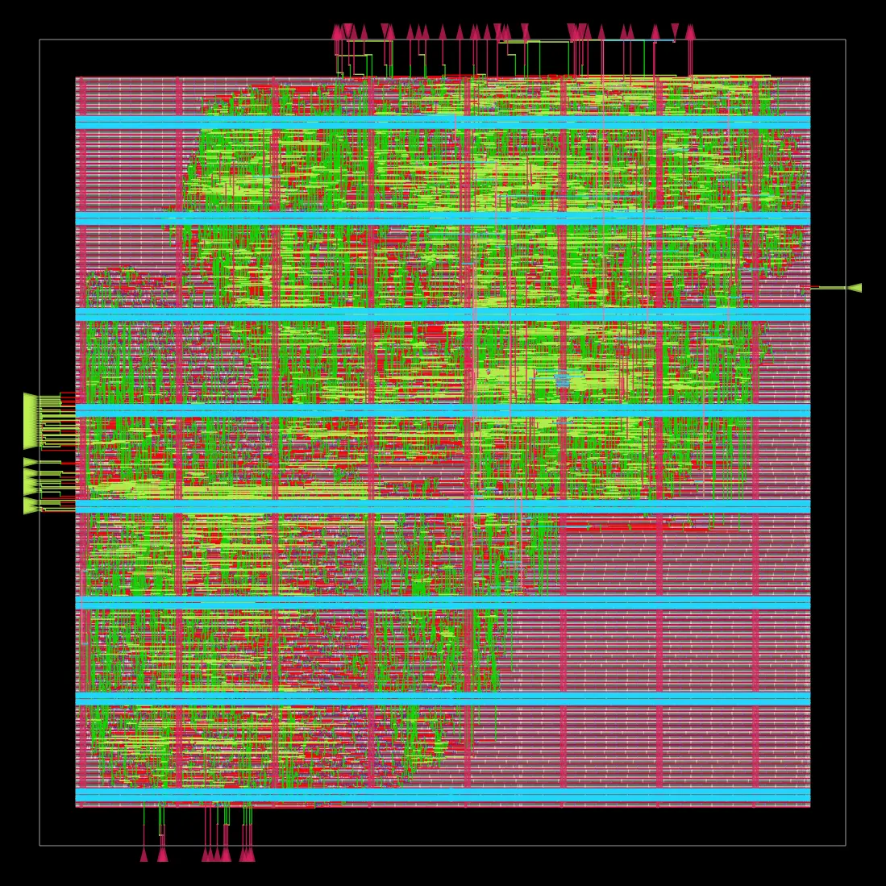
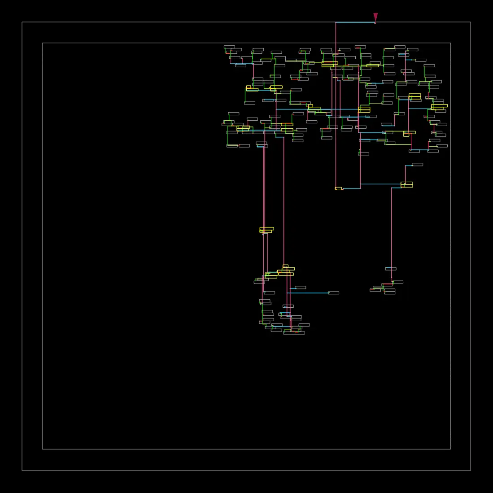
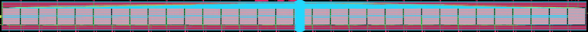
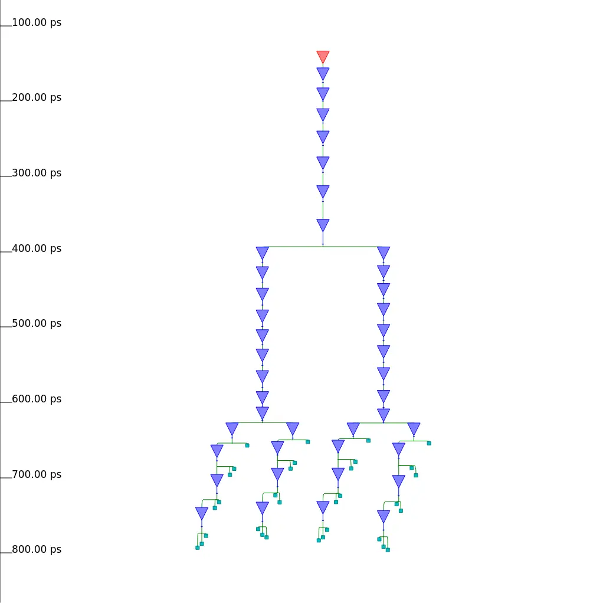
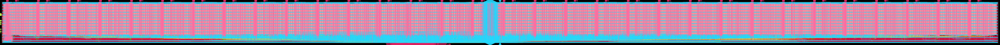

# PtahCore — Hardening Log (ASAP7 7nm)

Real place-and-route results, recorded honestly as each block closes.
**No masked hold violations, no negative slack margins** (see
docs/INVARIANTS.md §B4). If a block doesn't close, that's recorded too.

## Flow

OpenROAD-flow-scripts (ORFS) on the ASAP7 predictive PDK, driven by
`flow/harden.sh`:

```bash
# one-time: pull the flow image (WSL2 / Docker-Desktop needs a clean
# credential-helper-free config)
mkdir -p /tmp/dockercfg && echo '{}' > /tmp/dockercfg/config.json
DOCKER_CONFIG=/tmp/dockercfg docker pull openroad/orfs:latest

# harden a block
flow/harden.sh mac_cell
```

Design configs live in `flow/designs/asap7/<block>/`:
- `config.mk` — RTL list, platform, floorplan/utilisation
- `constraint.sdc` — clock + I/O timing (250 MHz target)

## Build order (per docs/TILE_SPEC.md)

1. **`mac_cell` tile** — the leaf abutted 1,024×. Must close timing, pass
   DRC, and present the abutment boundary contract.
2. **1×N row** — cells abutted with the traveling clock.
3. **32×32 array** — full grid via row abutment.
4. **`chip_top`** — array + control/memory/engine macros.

## Results

| Block | Status | Clock | Worst setup slack | Worst hold slack | Area | Util | Notes |
|-------|--------|-------|------------|------------|------|------|-------|
| `mac_cell` (pipelined mul \| add) | ✅ **GDS complete** | 250 MHz (4000 ps) | **+1928 ps** | **+13 ps** | **750 µm²** | 44% | signoff: 0 setup / 0 hold / 0 slew / 0 cap / 0 fanout violations, **DRC clean**; crit path ~2.07 ns → ~480 MHz capable |
| row (1×32, hierarchical) | ✅ **GDS complete** | 250 MHz (4000 ps) | **+386 ps** | **+438 ps** | **66,284 µm²** | 56% | 32 `mac_cell` hard macros (BLOCKS flow) + drain mux/broadcast stdcells; 0 setup / 0 hold / 0 cap / 0 fanout, **DRC clean**; ⚠ 3 max-slew pins ≤39 ps over the 320 ps lib limit (see below — recorded, not waived) |
| `mac_tile` (abutment tile) | ✅ **GDS complete** | 250 MHz (4000 ps) | **+1620 ps** | **+15 ps** | **773 µm²** | 39% | fixed 46.44×46.44 µm site-aligned outline; **0 violations of any type, DRC clean**; all 73 mirrored pin pairs verified coordinate-exact in the DEF; feedthrough arcs: A ~84–98 ps ≈ clk ~89 ps (traveling clock matched to the data wave by construction); internal clock insertion 54–70 ps |
| **row (1×32, ABUTTED + traveling clock)** | ✅ **GDS complete** | 250 MHz (4000 ps) | **+180 ps** | **+48 ps** | **71,984 µm²** | 83% | **no row CTS** — the clock enters tile 0 once and travels the chain (+82.34 ps/tile, STA-visible through all 32 tiles); 0 setup / 0 hold / 0 cap / 0 fanout, **DRC clean incl. all 31 abutted boundaries**; `check_abutment.py`: 32 tiles exact-grid, 1271 pin pairs edge-contact; ⚠ 2 max-slew pins ≤2.8 ps over (route-erosion tail, recorded) |
| array (32×32) | ⬜ | — | — | — | — | — | — |
| `chip_top` | ⬜ | — | — | — | — | — | — |

_(Pre-layout generic-gate area baselines are in docs/SYNTHESIS.md.)_

## First GDS — `mac_cell` on ASAP7

Full RTL→GDSII, signoff clean, on a laptop under WSL2:



*Routed `mac_cell` macro — 750 µm² @ 44% utilisation, ASAP7 7nm predictive
PDK. Clock tree below (17 buffers, 2-level H-tree, 164 sinks):*



The GDS itself (`flow/results/asap7/mac_cell/base/6_final.gds`) is a build
artifact — regenerate with `flow/harden.sh mac_cell` (~6 min).

### ⚠️ The picosecond units bug — and what actually happened

The mac_cell **closes 250 MHz setup with ~2 ns margin.** Getting there took a
detour worth recording honestly:

1. **Phase 6a** first P&R reported "WNS −2237 ps, fails 250 MHz." **This was a
   units bug.** ASAP7 SDC time is in **picoseconds** (the platform's own
   examples use `set clk_period 310`). My `set clk_period 4.0` meant **4 ps =
   250 GHz**, so of course everything "violated" — and the negative "ps" values
   were literally the real path delays: ~2.24 ns combinational.
2. **Phase 6b** pipelined the MAC (split multiply | add) — genuinely good design
   that cut the critical path and kept all 89 tests bit-exact — but still read
   the clock as 4 ps, so it looked like it "still failed at −1309 ps." I even
   chased a phantom "the adder can't be pipelined" conclusion.
3. **Phase 6c** found the bug: `4.0` → `4000` ps. With the correct clock the
   pipelined mac_cell closes 250 MHz setup at **+1994 ps slack**, critical path
   ~2.0 ns (≈ 500 MHz capable), 675 µm².

**Lessons kept:** always check the platform's SDC time unit; the pipelined MAC
is still the design we ship (more margin, ~500 MHz headroom, bit-exact). The
accumulate add is a loop-carried dependency and *would* be the floor if it were
the long pole — it isn't here (the multiply is, at ~2 ns), but a Kulisch
fixed-point accumulator remains the right move if we ever push past ~500 MHz.

### Hold — closed with real positive margin

CTS-stage `repair_timing` inserts hold buffers. With the default
`HOLD_SLACK_MARGIN = 0` it repairs to *exactly* zero slack — and post-route
RC then pushed 2 paths to **−1.11 ps**. The honest fix is the **opposite**
of autogpu's masking (they set the margin *negative* to hide violations,
INVARIANTS §B4): we set `HOLD_SLACK_MARGIN = 15` so repair demands +15 ps
of real slack at CTS, absorbing post-route RC pessimism. Final signoff:
**0 hold violations, worst hold slack +13.01 ps.**

<details><summary>Historical Phase 6b notes (pre-correction — kept for the record)</summary>

Pipelined the MAC: split multiply ↔ add, and (briefly) pipelined `fp32_mul`
internally. Reverted the internal-mul split — registering the raw product
dragged the mul's normalize into the add stage and measured worse than
registering the full product. Final design: combinational `fp32_mul`, register
its full output, combinational accumulate add. The pre-correction analysis
below read the clock as 4 ps and is superseded by the section above.

</details>

ASAP7 is a *predictive, deliberately pessimistic* PDK; the ns figures are
relative-honest, not a foundry guarantee — but the closure discipline is the
same either way.

## Second GDS — the 1×32 row (first hierarchical build, Phase 7a)

The Phase-6 `mac_cell` GDS becomes a **hard macro** (ORFS `BLOCKS` flow
auto-hardens it and consumes its LEF/.lib abstract), and the row top is just
the A-broadcast wiring, control fan-out, and the 32:1 drain mux. 1560×80 µm
die, macros on a deterministic 48.625 µm pitch (`macro_place.tcl`).



*Routed 1×32 row — 32 abutment-pitch `mac_cell` macros, ASAP7. Clock below
(row-level CTS for 7a; the traveling clock replaces it in 7b):*



Signoff: **setup +386 ps / hold +438 ps @ 250 MHz, 0 setup / 0 hold / 0 cap /
0 fanout violations, DRC clean**, 66,284 µm² @ 56% util.

### The virtual-clock/propagated-clock trap (the row's units-bug moment)

A block's I/O must be timed against a **virtual clock carrying the launch
latency of the parent's flops** — they sit on the same tree, so timing I/O
against the ideal clock manufactures ~1 ns of phantom *hold* violation into
every macro data pin (first run: hold repair hit its buffer cap at 1564
buffers, worst −669 ps, flow dead at CTS). The subtle part: the latency was
already modeled, but as **plain (network) `set_clock_latency`** — and ORFS
runs `set_propagated_clock [all_clocks]` after CTS, after which **OpenSTA
discards network latency**, silently reverting vclk to ideal. The fix is
`set_clock_latency -source`, which survives propagation. The slack math
confirmed it to the picosecond: 600 io − 150 src − ~990 tree − 29 lib hold
− 100 unc ≈ −669.

### The honesty check, exercised

The SDC required the modeled vclk latency to match post-route reality. First
model: 1150 ps; measured capture latency at the far macro: ~710 ps. The model
was **tightened to 750 ps and re-run** — checking hold ~400 ps *harder* —
and the row still closed (+438 ps worst hold). Models follow silicon, not
the other way around.

### The 3 residual max-slew pins — recorded, not waived

Three stdcell input pins on row-top mux/buffer nets read 330–359 ps against
the 320 ps lib `max_transition` (≤12% over). Root cause: `repair_design`
works from global-route RC estimates, and detailed route eroded a few
buffer-to-gate hops ~115 ps beyond them. `SLEW_MARGIN` was raised 10% → 20%
→ 30% (violators: 8 → 3 → 3, worst −58 → −51 → −39 ps); the knob saturated —
each run just shuffles which nets lose the detour lottery. The timer uses
the *actual* slews, so the +386/+438 slack already absorbs them; the
remaining risk is lib-extrapolation accuracy on 3 arcs, not function. The
row top's routing is redone in 7b (traveling clock + true edge abutment),
which is where these die for real.

## Third GDS — `mac_tile`, the tile that actually abuts (Phase 7b-2)

The TILE_SPEC contract, in silicon:

- **Fixed outline**: 46.44 × 46.44 µm — 860 sites × 172 rows, integral both
  ways, so abutted tiles land on-grid by construction.
- **Pins on the edges that carry them**, via OpenROAD's
  `set_io_pin_constraint -mirrored_pins`: every west-in mirrors its east-out
  (same y) and every north-in its south-out (same x). All **73 pairs verified
  coordinate-exact** against the final DEF — cell j's `a_out[k]` lands on
  cell j+1's `a_in[k]` pin-on-pin. Alignment is the constraint, not placer
  luck.
- **Traveling clock**: `clk_in` (west) → `clk_out` (east). The characterised
  `.lib` shows the clock feedthrough at **~89 ps** and the A-data
  feedthrough at **~84–98 ps** — the clock and the data wave cross the tile
  together, which is the whole point: at row scale the wave costs nothing
  because every tile's capture clock arrives just as its data does.
- **Layer split**: tile keeps M1–M5, parent gets M6–M7 (BLOCK PDN grid).

Signoff: **setup +1620 ps / hold +15 ps @ 250 MHz, zero violations of any
type, DRC clean**, 773 µm² @ 39% util. One open item for 7b-3:
`write_timing_model` encodes the `clk_in→clk_out` arc with a `falling_edge`
type and a negative rise reference — the row STA must be checked to consume
it correctly (the `min/max_clock_tree_path` entries, 54–70 ps, carry the
internal insertion).

## Fourth GDS — the abutted traveling-clock row (Phase 7b-3)

The chip-scale clocking thesis, proven at row scale: **32 mac_tile macros
abutted pin-on-pin with zero gap, no row clock tree.** The clock enters
tile 0 once and marches east through each tile's characterised
clk_in→clk_out feedthrough — STA shows it arriving +82.34 ps later per
tile, rising edge preserved, with every input wave matched to travel
with it. Signoff: **setup +180 ps / hold +48 ps @ 250 MHz, 0 setup / 0
hold violations, DRC clean across all 31 abutted boundaries**, 71,984 µm²
@ 83% util. The worst hold path is `a_f32 → col[31]` — the far end of the
wave — at **positive** margin, which is the whole point.



Five real problems stood between run 1 and this GDS, each now in the
failure log below: macro track-phase snapping, PDN ring margins, a
placer divergence, the PDN halo conflict, and — the big one — a .lib
encoding that silently unconstrained 31 of 32 tiles.

### The false-clean: a .lib arc that ate the clock

`write_timing_model` encodes the tile's clk_in→clk_out feedthrough as a
`falling_edge` arc. Edge-triggered arcs **terminate clock propagation**
in OpenSTA (same rule as a flop's clk→q) — so in the first completed
run, only tile 0 had a clock; **tiles 1–31 were silently unconstrained**
and the report looked plausible (it still showed violations — all on
tile-0-reachable paths). `flow/patch_tile_clk_arc.py` rewrites the arc
`combinational`/`positive_unate`, reusing the tool's own measured fall
tables (~82 ps); `flow/harden_abutted_row.sh` applies it between the
block abstract and the parent run. A model-encoding fix, not a waiver —
and the moment the clock became visible, the next real bug surfaced:

### The data wave outran the clock wave

The 1-bit control feedthroughs cross a tile in ~46 ps; the clock takes
~82 ps. From ~tile 16 east, data arrived **before** its capture clock —
genuine hold violations on every far tile, invisible until the clock
propagated. Fix at the source, per TILE_SPEC §3: `set_min_delay 85` on
every west→east feedthrough in the tile (rev B), so the data wave gains
margin eastward instead of losing it. Setup tolerates data lagging the
clock; hold does not tolerate it leading.

### The drain came home a cycle late — so the RTL pays the cycle

A far tile launches its accumulator on a clock that has traveled ~2.7 ns
east; the combinational 32:1 mux could not return it across 1.5 mm
within the same early-clock cycle (**−460 ps post-route, all 32
drain_out bits — the honest single-cycle failure**). Fixed in RTL, not
SDC: the row registers its drain (`mac_row.sv`), the array delays its
row-select to match, and STORE grew a request/write-back stage (+1 cycle
latency per STORE, throughput unchanged, all 94 tests bit-exact).
`drain_slot` — latched at STORE start and burst-static by construction —
is declared multicycle-2, mirroring the RTL contract the way `rst` is
false-pathed.

### B travels too (the array contract, modeled honestly)

At array scale the B bus runs along the north edge west→east,
accumulating the same per-tile delay as the clock. The row's SDC models
per-column B input delays (`io_delay + j × 82.34 ps`); a flat delay
would manufacture a ~2.5 ns phantom hold wall the real array never
produces. Phase 7c implements that delivery physically.

## Failure log

Every distinct flow error hit, with root cause + fix, so it's never
re-debugged from scratch.

| Error / symptom | Block | Root cause | Fix |
|-----------------|-------|-----------|-----|
| "fails 250 MHz, WNS −2237 ps" | mac_cell | **ASAP7 SDC time is in picoseconds** — `set clk_period 4.0` = 4 ps (250 GHz), so everything "violated" by its real path delay | use ps: `set clk_period 4000`; design closes with +1994 ps |
| `read_verilog`: "File `SYNTHESIS' not found" | mac_cell | ORFS default Yosys frontend needs `-D` prefix on defines | `VERILOG_DEFINES = -DSYNTHESIS` (not `SYNTHESIS`) |
| SDC: `invalid command name "remove_from_collection"` | mac_cell | OpenROAD's SDC reader lacks `remove_from_collection` | list data ports explicitly in `set_input_delay` |
| `cts.tcl: child killed: illegal instruction` (SIGILL) | mac_cell | **NOT TritonCTS** (initial diagnosis was wrong — CTS + hold repair had already completed in the log). The crash is `run_lec_test` exec-ing the image's `kepler-formal` LEC binary, which uses an instruction this host lacks (i7-9750H has AVX2 but no AVX-512) | `export LEC_CHECK = 0` in config.mk. LEC is an optional post-repair equivalence check; netlist-vs-RTL equivalence is covered by the bit-exact cocotb suite. CTS→route→GDS proceed normally. |
| 2 hold violations post-route, worst −1.11 ps | mac_cell | `HOLD_SLACK_MARGIN` defaults to 0 → CTS hold repair fixes to exactly zero slack, then detailed-route RC pushes marginal paths slightly negative | `export HOLD_SLACK_MARGIN = 15` (a **positive** margin — real extra slack, not masking). Signoff: 0 hold violations, worst +13.01 ps |
| CTS hold repair dies at buffer cap (RSZ-0060), worst −669 ps on every macro data pin | mac_row | vclk launch latency was plain (network) `set_clock_latency`; ORFS `set_propagated_clock [all_clocks]` post-CTS makes OpenSTA discard it → vclk silently ideal → phantom hold wall | `set_clock_latency -source` on the virtual clock — source latency survives propagation |
| setup 0 → −70 ps and 8 slew violations appear only after detailed route | mac_row | repair stages work from global-route RC; detailed-route detours erode the margin they closed to | `SETUP_SLACK_MARGIN = 100`, `SLEW_MARGIN = 30` — repair banks real margin pre-route (same honest pattern as the hold margin) |
| `DPL-0036` detailed placement fails to legalize 1 buffer | mac_row | margin-driven rebuffering outgrew the stdcell strip of the 1560×70 die (macro+halo eats ~47 µm) | die height 70 → 80 µm |
| `MPL-0003` "no valid tilings for mixed cluster" | mac_row | `rtl_macro_placer` heuristics can't tile a 1×32 mixed cluster at 19.5:1 aspect ratio | deterministic `place_macro` script (`MACRO_PLACEMENT_TCL`) — the row layout is fully determined anyway; note ODB instance names keep Yosys escapes: `col\[0\].u_cell` |
| detailed route never converges (466 stuck violations), then OOM | mac_row | macros placed flush against the core's south edge → no routing channel below the macro pins | center the macro row vertically (y = 16.2 µm = 60 site rows) — channels both sides; DRC clean afterwards |
| detailed route OOM at ~7.2 GB (make error 247) | mac_row | OpenROAD defaults to all 12 threads; WSL2 VM has 7 GB | `ORFS_MAKE_ARGS='NUM_CORES=6'` passthrough added to `flow/harden.sh` (ORFS: `OPENROAD_ARGS = -threads $(NUM_CORES)`) |
| 3 max-slew pins survive `SLEW_MARGIN = 30`, worst −39 ps | mac_row | global-route vs detailed-route RC mismatch on individual buffer hops (~115 ps) exceeds any practical uniform margin | **recorded, not waived** — slacks already include the real slews; row top is re-laid-out in 7b |
| `MPL-0041` overlap placing abutted macros at exact pitch | mac_row_abut | `place_macro` snaps macros to routing tracks; a tile width that is site-aligned but not track-aligned flips track phase tile-to-tile (+24 nm = half an M5 pitch) | tile dims must be multiples of every owned track pitch: width quantum 0.432 µm, height quantum 2.16 µm → tile resized 46.44² → **46.656 × 47.52** (TILE_SPEC §1 updated) |
| `PDN-0351` rings don't fit | mac_row_abut | BLOCKS PDN rings need ~1.7 × 1.6 µm of core-to-die spacing; 1.08 µm given | core-to-die spacing 2.16 µm |
| `GPL-0305` RePlAce diverges (Inf/NaN) | mac_row_abut | ~250 µm² of stdcells in a 71k µm² macro sea — routability/timing inflation (+339%) explodes the gradient | `GPL_ROUTABILITY_DRIVEN=0`, `GPL_TIMING_DRIVEN=0` (trivial placement problem) |
| `PSM-0069` every tile's VDD unconnected (end of flow) vs `PDN-0179` channel error (halo 0) | mac_row_abut | `MACRO_ROWS_HALO` drives BOTH row cutting and the per-macro PDN grid; abutment needs them split: PDN halo must be 0 (overlapping ElementGrids silently skip all pin connects) while rows must stay cut ~2 µm clear (halo 0 leaves an unrepairable M2 rail sliver) | design-local `pdn.tcl` with the ElementGrid halo hardcoded 0; row cutting keeps the platform default. Verified with `check_power_grid` on the floorplan (~1 min iteration, no full flow) |
| tiles 1–31 silently UNCONSTRAINED (false-clean timing) | mac_row_abut | `write_timing_model` encodes clk_in→clk_out as a `falling_edge` arc → OpenSTA terminates clock propagation at tile 0's clk_out | `flow/patch_tile_clk_arc.py` (combinational, measured tables); applied by `flow/harden_abutted_row.sh` between block abstract and parent run. **Verify clock arrival per tile in the report before trusting ANY hierarchical timing** |
| far-tile hold violations once the clock propagated | mac_row_abut | data feedthroughs (~46 ps/tile) outran the clock feedthrough (~82 ps/tile) — data arrived before its capture clock from ~tile 16 | tile rev B: `set_min_delay 85` on every west→east feedthrough (wave matching, TILE_SPEC §3) |
| all 32 drain_out bits fail setup −460 ps | mac_row_abut | far tiles launch on a clock ~2.7 ns east; combinational mux return can't recross 1.5 mm in the early-clock cycle | RTL: registered row drain + array row-select delay + STORE write-back stage (94 tests bit-exact); drain_slot multicycle-2 mirrors its burst-static RTL contract |
| `make all_leaves` exits 0 with failing tests | rtl/tb | cocotb 1.x's Makefile.sim does not propagate test failures | `rtl/tb/check_results.py` parses results.xml after every sim; the driver fails on any `<failure>` |
| 2 max-slew pins, worst −2.8 ps | mac_row_abut | same GR-vs-DRT erosion tail as the 7a row, now ≤0.9% over the limit | **recorded, not waived** |
| CTS hold repair buffer cap (RSZ-0060) again; hold WNS −2670 ps at the drain register, setup repair stuck at −8566 ps on 52.5k endpoints | mac_grid (first attempt, δs=150) | the SDC's southward clock stagger was a guess (150 ps/row); measured in-context the southbound arcs are b_in→b_out 88.9 ps and drain_n_in→drain_s_out only **52.6 ps** (a bare mux, never floored) — far rows' drain led the south-strip capture clock by ~2.7 ns, and no single δs satisfies B (wants ≈89) and drain (wants ≤53) at once | tile **rev C**: `set_min_delay 85` on BOTH vertical feedthroughs (the rev-B wave-matching rule rotated 90°), grid δs = 85. Measure the waves before constraining them — pre-CTS STA on the placed odb gives the per-row arc table in minutes |
